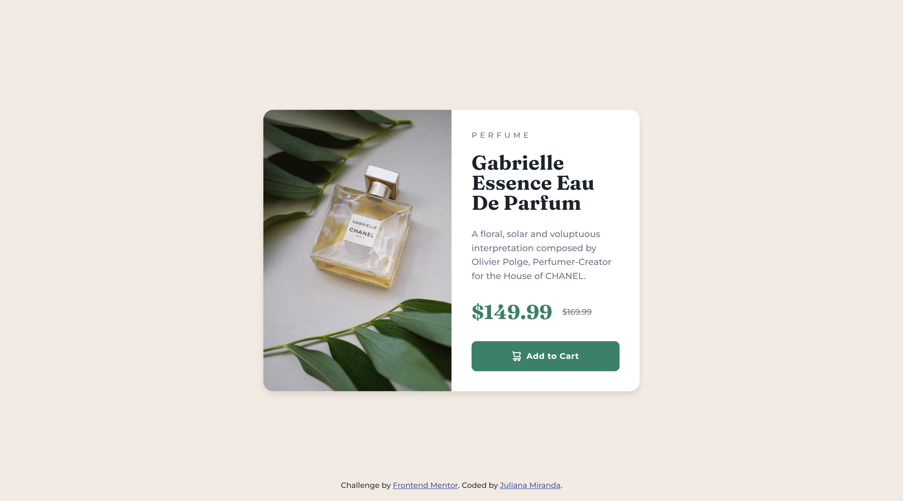

# Frontend Mentor - Product preview card component solution

This is a solution to the [Product preview card component challenge on Frontend Mentor](https://www.frontendmentor.io/challenges/product-preview-card-component-GO7UmttRfa). Frontend Mentor challenges help you improve your coding skills by building realistic projects. 

## Table of contents

- [Overview](#overview)
  - [The challenge](#the-challenge)
  - [Screenshot](#screenshot)
  - [Links](#links)
- [Author](#author)

## Overview

### The challenge

Users should be able to:

- View the optimal layout depending on their device's screen size
- See hover and focus states for interactive elements

### Screenshot

### Links

- Solution URL: [Frontend Mentor solution page](https://www.frontendmentor.io/solutions/product-preview-card-component-B8uBPGuKue)
- Live Site URL: [fm-product-preview-card](https://jumiranda5.github.io/fm-product-preview-card/)

## Author

- Frontend Mentor - [@jumiranda5](https://www.frontendmentor.io/profile/jumiranda5)